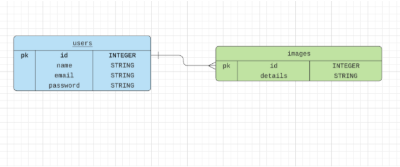
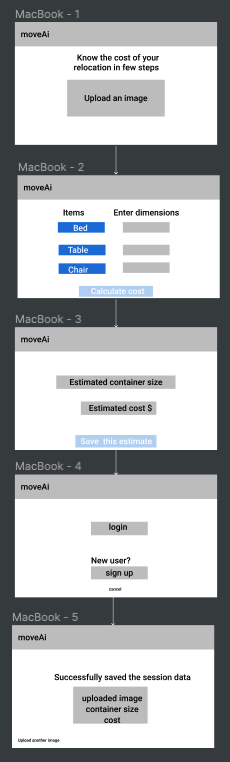

# moveAI

#### moveAI is a relocation assistance app. Which lets you calculate the cost of your shipment.

### What problem does it solve?

#### Automating the process of categorizing items and suggesting container size and estimated cost.The existing practice in the industry is either a user estimates the container size they think will require or the service provider visits the client and gives an estimate. These are manual processes and lead to last minutes of hassle.

### User story

- A user wants to know the cost of their shipping their belongs from place-A to place-B
- They open moveAi app. Upload pictures of their house(room by room)
- The app reads the content of the picture and gives back the list of the items in the room
- Against each listed item user keys in an estimated dimension size for that item
- The app calculates the container size needed for the shipment and tells the relocation price to the user.

### MVP

- user can calculate the cost as a guest user
- image upload functionality and cost calculation
- user can save their recent session by logging in.

### Technologies

- CRA front end
- PostgreSQL
- Google's vision API

### ERD

### Wireframe

